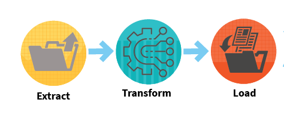
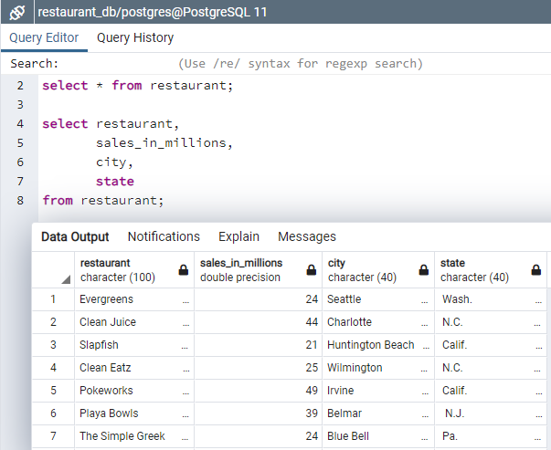

# ETL_Project

# Restaurant Business Rankings 2020

## Introduction

(Image source: https://www.standard.co.uk/)

There were many summaries created in the year 2020, in the form of rankings by the "Restaurant Business" magazine. On the website you can find only basic information about ranked restaurants, the full data and analysis are available in the paid report.

The pandemic had a major impact on a lot of businesses. The data can be used to tell the story of what 2020 was like for restaurants, what was popular, what could be more popular soon, or what the difference is between large companies and smaller businesses.

The source of information for the ETL project is Kaggle. The dataset consists of 3 CSV files, Future50.csv, Independence100.csv and Top250.csv

## Objective of the Project

The agenda of the project was to arrive at a single datasource consisting of the top restaurants information. This is achieved by using the 3 datasets that gives information of the ranking of the restaurants based on the sales made in the year 2020.

## ETL Prework setup in pgAdmin

* The 'restaurant_db' database is created in pgAdmin4 and then the following table is created within:
    
	* A 'restaurant' table is created consisting of the 'index' column as the primary key.
	* The other columns that are created are 'restaurant','sales_in_millions', 'city', 'state'. 

## ETL(Extract Transform Load) Process

(Image source: https://www.era-environmental.com/)

## Extract

The extraction process involved importing the 3 CSV files into pandas dataframes. The 3 CSV files that were imported and converted to dataframes were Future50.csv, Independence50.csv and Top250.csv

## Transform

The transformation process includes dropping the unnecessary columns that is not necessary for the final table. This was done for all the 3 dataframes. The number of rows in each of them are 50, 100 and 250 rows respectively.

The 3 dataframes are merged using the outer merge to arrive at the final dataframe with 400 rows. This dataframe has some duplicate column names and NaN values.

The data transformation involved copying the values from duplicate columns for respective restaurants where the values are null, so that we are not losing any data. The extra columns are then dropped in the next step.

The duplicate columns are dropped using the drop() function.

The column names are renamed in the format as is required in the database.

## Load

A connection to the database is setup. The successful connection to the database is verified by checking the table is created using engine.table_names(). The next step was to load the final dataframe into the database.

The loading of the table is verified by querying the database.

## Conclusion

The ETL process was implemented to arrive at a single dataset that was saved in the database for further analysis and reference. The database table consists of 400 rows of clean data from the 3 datasets that provides information about top restaurants that were ranked based on sales in the year 2020.

 